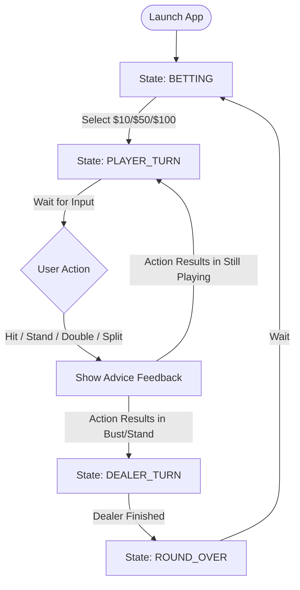

# Blackjack Trainer UI Technical Specification

## Overview
The Blackjack Trainer UI will be implemented using `tkinter`. It follows an event-driven architecture where user interactions (button clicks or keyboard presses) trigger logic in the `BlackjackGame` class, followed by a full UI refresh to reflect the new state.

## Class: `BlackjackUI`

### Attributes
- `root`: The `tkinter.Tk` main window.
- `game`: An instance of `BlackjackGame`.
- `dealer_canvas`: Canvas for rendering the dealer's hand.
- `player_hands_container`: A Frame to hold multiple canvases (one per player hand for splits).
- `player_canvases`: List of `Canvas` objects for player hands.
- `status_label`: Displays game messages and feedback (e.g., "Correct Move!").
- `bankroll_label`: Displays the player's current bankroll.
- `bet_buttons_frame`: Frame containing betting buttons ($10, $50, $100).
- `action_buttons_frame`: Frame containing game action buttons (Hit, Stand, etc.).

### Key Methods

#### Initialization & Setup
- `__init__(self, root, game: BlackjackGame)`:
  - Initializes the UI components and binds events.
- `_setup_ui(self)`:
  - Creates the main layout using `pack` or `grid`.
  - Initializes labels, frames, and canvases.
- `_bind_keys(self)`:
  - `root.bind("<h>", self.handle_hit)`
  - `root.bind("<s>", self.handle_stand)`
  - `root.bind("<d>", self.handle_double)`
  - `root.bind("
", self.handle_split)`

#### Rendering
- `update_ui(self)`:
  - The central method called after any state change.
  - Updates labels (bankroll, status).
  - Toggles visibility of betting buttons vs. action buttons.
  - Redraws dealer and player hands.
- `_draw_hand(self, canvas, hand, hide_first_card=False)`:
  - Clears the canvas and iterates through cards in the hand.
- `_draw_card(self, canvas, card, x, y, hidden=False)`:
  - Renders a card as a white rectangle with a border.
  - Displays rank and suit in the corners.
  - Color-codes suits: Red (♥, ♦) and Black (♠, ♣).
  - If `hidden=True`, draws a card back (e.g., blue/gray pattern).

#### Event Handlers
- `handle_bet(self, amount)`:
  - Calls `self.game.start_round(amount)`.
  - Updates UI to transition to `PLAYER_TURN`.
- `handle_hit(self, event=None)`:
  - Calls `self.game.hit()`.
  - Refreshes UI.
- `handle_stand(self, event=None)`:
  - Calls `self.game.stand()`.
  - Refreshes UI.
- `handle_double(self, event=None)`:
  - Calls `self.game.double_down()`.
  - Refreshes UI.
- `handle_split(self, event=None)`:
  - Calls `self.game.split()`.
  - Refreshes UI.

## Visual Design

### Card Dimensions
- Width: 70px
- Height: 100px
- Corner Radius: 5px (simulated with `create_rectangle`)

### Layout Mockup
1. **Top**: Dealer's Hand (Canvas)
2. **Middle**: Status/Feedback Message (Label)
3. **Bottom-Center**: Player's Hand(s) (Container Frame with multiple Canvases)
4. **Bottom**: Action Controls (Buttons & Bankroll/Bet labels)

## Game Flow & State Transitions

## Strategy Feedback
- The `status_label` will use color-coded text:
  - **Green**: "Correct move!"
  - **Red**: "Incorrect. You should have [Recommended Move]."
- Feedback is pulled from `self.game.last_move_feedback`.

## Keyboard Mapping
| Key | Action |
|-----|--------|
| H   | Hit    |
| S   | Stand  |
| D   | Double |
| P   | Split  |
